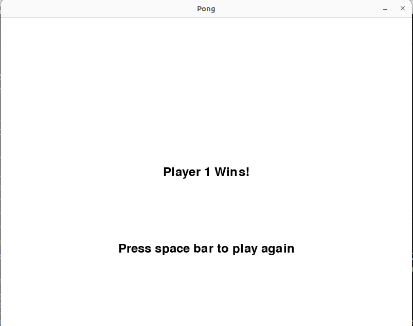

# Games

Pong - pong

## Pong

### Descrição

Jogo Pong desenvolvido com PyGame.

Snake - snake

## Snake

### Descrição

Jogo Snake desenvolvido com PyGame.

Maze - maze

## Maze

### Descrição

Jogo Maze desenvolvido com PyGame. O jogo tem um gerador de labirintos para toda vez que encontrar a saída gerar um novo labirinto.

